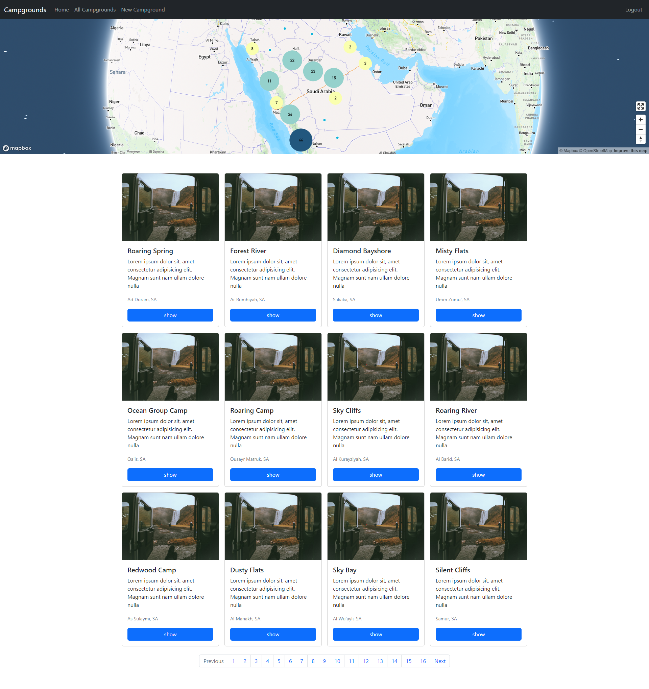

# YelpCamp
YelpCamp is a web application developed using Node.js as part of The Web Developer Bootcamp by Colt Steele on Udemy. 
This application serves as a platform for users to add, review, and rate various campgrounds. 
It encourages users to share their experience, feedback and any issues they faced, thereby providing a comprehensive guide for others planning their camping trips.

## Overview


## Demo
> This gif shows a brief overview of the project, and it may take a while to load!


## Features
- Authentication:
    - Users can log in using their username and password.
- Authorization:
    - Access to post management is restricted to authenticated users.
    - Users are not allowed to alter or remove posts and reviews made by others.
- Campground Post Management:
    - Authenticated users can create, edit, and delete posts and reviews.
    - Users can upload photos of campgrounds.
- Other Features:
    - Display of campground locations using mapbox.
    - Flash messages that respond to users' interactions with the app.
    - Responsive web design.
    - Star review for any campground
 
## 🚀 Getting Started
### To run this project on your system:
- Ensure Node.js is installed on your system.
- Clone project.
- Navigate to the project directory.
- Run npm install to install the necessary dependencies.
- Create an .env file and add values to the following variables:
```
CLOUDINARY_CLOUD_NAME=
CLOUDINARY_KEY=
CLOUDINARY_SECRET=
MAPBOX_TOKEN=
DB_URL=
SECRET_SESSION=
PORT=
```
- Execute 'npm start' to start.
